# MicroFun 地图资源拆分与组合技术方案

## 1. 概述

本项目旨在解决2D游戏中超大尺寸地图（例如，由多个屏幕拼接而成的广阔卷轴地图）带来的显存占用过高、加载时间长及性能瓶颈问题。对于一款2D休闲放置类游戏，流畅的拖动与缩放体验至关重要，传统的一次性加载方案难以满足此要求。

为应对此挑战，此方案提出一套基于 **自适应四叉树 (Adaptive Quadtree)** 的地图资源拆分与组合方案。该方案通过在预处理阶段将大地图智能拆分为不同粒度的瓦片 (Tile)，并在客户端运行时根据玩家视野动态、异步地加载和组合这些瓦片，从而实现显存的按需使用和流畅的无缝世界体验。

核心优势在于：

- **大幅降低显存峰值**：仅加载视野内及预加载区域的资源。
- **缩短初始加载时间**：游戏启动时无需等待整张地图加载。
- **提升渲染帧率稳定性**：通过异步加载和LOD机制，避免因IO阻塞导致的游戏卡顿。
- **优化存储空间**：对纯色区域进行编码存储，减少资源冗余。

## 2. 拆分策略：自适应四叉树

本方案选择四叉树作为核心空间索引结构，因为它能对二维空间进行高效的层级划分，完美契合地图LOD (Level of Detail) 的需求。

### 2.1. 拆分粒度与依据

拆分过程在项目预处理阶段 (`./run.sh split`) 完成。它并非采用固定的网格划分，而是采用一种**自适应**的策略。

1. **初始化**：将整张地图作为四叉树的根节点。
2. **递归拆分**：对每个节点执行以下检查：
   * **复杂度分析**：检查当前节点代表的图像区域是否为“纯色”或“低复杂度”。通过计算该区域内像素颜色的方差来实现，如果方差低于预设阈值，则认为该区域颜色统一。
   * **纯色节点**：如果一个节点被判定为纯色，则停止对该节点的继续拆分。在最终的索引文件中，该节点将被标记为纯色节点，并记录其对应的颜色值（例如 `0xRRGGBBAA`）。它将**不会**生成对应的图片文件，这是本方案的关键优化之一。
   * **高复杂度节点**：如果节点代表的区域颜色复杂，则将其均匀拆分为四个子节点（左上、右上、左下、右下），并对每个子节点递归执行相同的拆分逻辑。
   * **终止条件**：当节点尺寸达到预设的最小粒度时（例如 32x32 像素），无论其复杂度如何，都将强制停止拆分，并生成对应的瓦片图片文件。这确保了即使在最复杂的区域，也能有具体的图像数据。

### 2.2. 优势与劣势

**优势**:

- **存储高效**：对于游戏中的纯色背景、大块UI面板或低细节的静态美术资源，无需存储为大量重复的图片文件，极大减少了打包后的资源体积。
- **LOD天然支持**：四叉树的层级结构天然对应了地图的LOD。缩放地图时，远处可以使用低层级（大而模糊）的瓦片，近处使用高层级（小而精细）的瓦片，优化渲染性能。
- **查询高效**：基于区域的查询（AABB查询）在四叉树上速度很快，能迅速找出视野内的所有瓦片。

## 3. 组合机制：基于视野的动态调度

地图的组合发生在客户端运行时 (`./run.sh check`)，其核心是根据玩家视野动态地调度、加载、渲染和卸载瓦片。

### 3.1. 触发机制与加载策略

- **触发机制**：瓦片的加载和卸载主要由**玩家视野（相机）的变化**触发。当玩家拖动或缩放地图时，系统会重新计算需要显示的瓦片集合。
- **加载策略**:

  1. **视野查询**：每一帧，系统获取当前相机在地图空间中的2D包围盒 (Bounding Box)。
  2. **索引查询**：使用此包围盒查询 `QuadTreeIndex`，获取所有与视野相交的瓦片节点ID列表。
  3. **优先级调度**：根据瓦片节点在四叉树中的深度（LOD级别）和与视野中心的距离，对需要加载的瓦片进行优先级排序。高LOD级别、靠近视野中心的瓦片拥有最高优先级。
  4. **异步加载**：一个独立的 `AsyncTileLoader` 模块（使用线程池）负责根据优先级加载瓦片。它首先检查瓦片是否已在 `TileCache` 中，若未命中，则从磁盘异步读取文件数据。这确保了加载过程不会阻塞渲染主线程。

### 3.2. 卸载策略

- **缓存管理**：所有加载到内存的瓦片数据都由 `TileCache` 模块管理。该模块有固定的显存预算（例如 512MB）。
- **淘汰机制**：当新瓦片加载导致超出显存预算时，缓存系统会触发淘汰机制。完全移出视野外的瓦片会立即成为可淘汰对象。淘汰机制将采用 **LRU (Least Recently Used)** 算法，优先卸载最近最少使用的瓦片，以释放显存空间。

### 3.3. 过渡处理

为确保地图块加载/卸载过程中的平滑过渡，避免跳变和卡顿，采用以下策略：

- **异步加载**：如前所述，所有IO操作均在后台线程完成，避免了主线程的阻塞，从而保证了帧率的稳定。
- **预加载 (Pre-loading)**：根据玩家的拖动方向和速度，系统可以预测接下来可能进入的区域，并提前将相关瓦片提交给 `AsyncTileLoader` 进行低优先级加载，进一步减少了实时加载的延迟感。

## 4. 工作流程

下图展示了本方案在客户端的完整工作流程。

## 5. 性能预期

- **显存占用**：通过按需加载视口内的瓦片，方案将显著降低运行时的峰值显存占用，避免了全量加载大尺寸纹理带来的内存压力。
- **加载时间**：玩家进入场景的初始加载时间将大幅缩短。系统仅需加载核心索引及初始视口内的瓦片，其余资源在后台动态载入。
- **帧率稳定性**：通过将文件IO操作置于异步线程处理，可以有效避免因资源加载导致的渲染主线程阻塞，从而提供更平滑、稳定的帧率表现。
- **存储空间**：纯色节点优化将有效压缩包含大面积统一颜色区域（如背景、透明区域）的地图资源，降低最终产品的磁盘空间占用。
