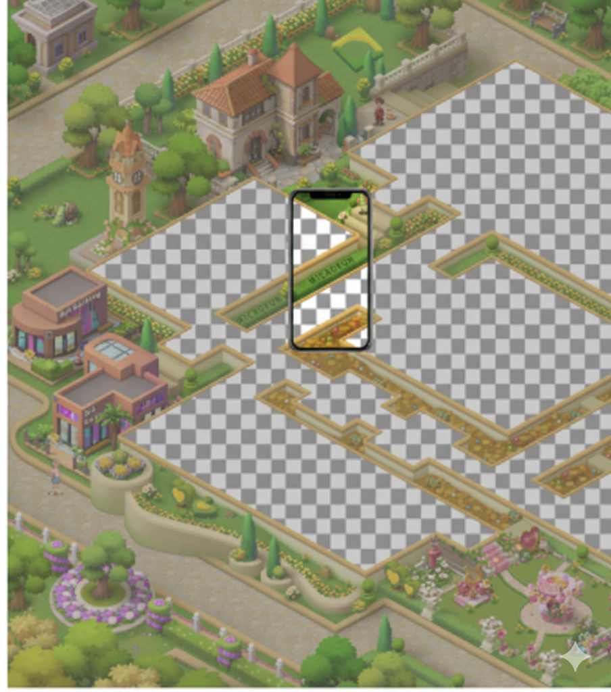
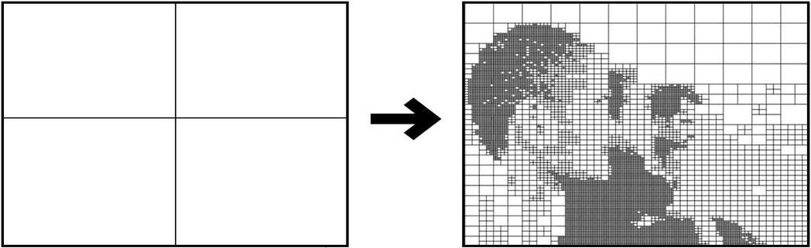
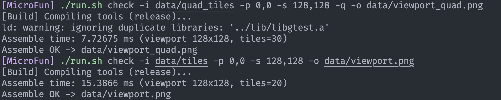
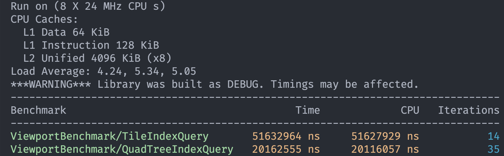

# MicroFun 地图资源拆分与组合技术方案

#### 基于自适应四叉树的大地图优化解决方案

<!-- _class: cover_a -->
<!-- _header: "" -->
<!-- _footer: "" -->
<!-- _paginate: "" -->

雒俊为
北京航空航天大学
2025年9月11日


<!--
演讲稿（时长：1分钟）

各位面试官好，今天我将向大家介绍MicroFun项目——一个专注于解决大型2D游戏地图资源优化的技术方案。

这个项目的核心目标是解决游戏开发中一个非常实际的技术挑战：当游戏地图变得越来越大时，如何在保证流畅体验的同时，有效管理内存占用和加载性能。

我们的解决方案基于自适应四叉树算法，结合动态加载机制，实现了智能的地图资源管理。接下来的10分钟，我将从问题分析、技术方案、核心算法到性能优化，全面展示这个项目的技术亮点。
-->

## 目录

<!-- _class: toc_a -->
<!-- _header: "目录 CONTENTS" -->
<!-- _footer: "" -->
<!-- _paginate: "" -->

- [核心问题](#核心问题)
- [解决方案](#解决方案)
- [拆分策略：自适应四叉树](#拆分策略自适应四叉树)
- [动态加载机制](#动态加载机制)
- [工作流程](#工作流程)
- [预期性能提升](#预期性能提升)
- [总结与展望](#总结与展望)

<div class=ldiv>

## 核心问题

- 🔥 **显存占用过高** - 完整地图加载导致内存压力
- ⏱️ **加载时间长** - 游戏启动需等待大量资源
- 📉 **性能瓶颈** - 拖动缩放时卡顿明显
- 💾 **存储冗余** - 纯色区域重复存储

</div>

<div class=rimg>



</div>

<!-- _class: navbar cols-2 -->
<!-- _header: \ ***MicroFun*** **核心问题** *解决方案* *拆分策略* *动态加载* *工作流程* *性能提升* *总结*-->


## 解决方案

<!-- _class: navbar -->
<!-- _header: \ ***MicroFun*** *核心问题* **解决方案** *拆分策略* *动态加载* *工作流程* *性能提升* *总结*-->

### 自适应四叉树 + 动态加载

**核心思想：**

- 预处理阶段智能拆分地图
- 运行时按需动态加载
- 纯色区域编码优化
- 天然的LOD层级渲染支持
  
<!-- _class: navbar -->
<!-- _header: \ ***MicroFun*** *核心问题* **解决方案** *拆分策略* *动态加载* *工作流程* *性能提升* *总结*-->

<!--
演讲稿（时长：1分钟）

针对这些挑战，我们设计了一个基于自适应四叉树的解决方案。这个方案的核心思想可以概括为四个要点：

首先是预处理阶段的智能拆分。我们不是简单地将地图均匀切割，而是根据图像内容的复杂度进行自适应拆分，这样可以更好地平衡存储效率和访问性能。

其次是运行时的按需动态加载。只有当用户的视野需要某个区域时，我们才加载对应的瓦片，这大大减少了内存占用。

第三是纯色区域的编码优化。对于那些颜色单一的区域，我们不存储图片文件，而是直接记录颜色值，这可以显著减少存储空间。

最后，四叉树的层级结构天然支持LOD（Level of Detail）渲染，当用户缩小地图时，可以使用低分辨率的瓦片，提高渲染效率。

这个方案的优雅之处在于，它不仅解决了单个问题，而是通过一个统一的架构解决了我们提到的所有核心挑战。
-->

<div class=limg>

## 拆分策略

基于四叉树分割图像算法，这是一种空间递归划分的图像分割技术，核心思想是将图像逐步分解为大小相等的四个子块（象限），并根据预设的 **“同质性准则”** 判断子块是否需要继续分割。

</div>

<div class=rimg>



</div>

<!-- _class: navbar cols-2 -->
<!-- _header: \ ***MicroFun*** *核心问题* *解决方案* **拆分策略** *动态加载* *工作流程* *性能提升* *总结*-->

### 拆分算法流程

```
1. 初始化：整张地图作为根节点
2. 复杂度分析：区分纯色与复杂区域
3. 决策分支：
   • 纯色区域 → 停止拆分，记录颜色值
   • 复杂区域 → 拆分为4个子节点
4. 终止条件：最小粒度 32x32 像素
```

**结果：** 纯色节点不生成图片文件，仅记录颜色值，复杂区域保存图片，加载时根据路径进行加载。

<!-- _class: navbar -->
<!-- _header: \ ***MicroFun*** *核心问题* *解决方案* **拆分策略** *动态加载* *工作流程* *性能提升* *总结*-->
<!--
演讲稿（时长：1.5分钟）

现在让我详细解释四叉树拆分算法的工作原理。这是整个系统的核心技术。

算法的执行过程分为四个步骤。首先，我们将整张地图作为根节点开始处理。然后进行复杂度分析，这里的关键是如何判断一个区域是纯色还是复杂的。

我们的判断标准很直接：计算区域内所有像素的颜色方差，如果方差小于设定阈值，就认为是纯色区域。这个方法既简单又有效。

决策分支是算法的智能之处：对于纯色区域，我们停止拆分，仅保存一个RGBA颜色值；对于复杂区域，我们将其拆分为四个子节点，递归进行相同的判断。

终止条件设定为32x32像素，这是基于实际测试得出的最优粒度。太小会导致瓦片数量过多，太大会影响加载精度。

这个算法的优势在于自适应性：对于大片纯色区域，如天空或海洋，可能在很高的层级就停止拆分；而对于建筑物密集的城市区域，会拆分到更细的粒度。最终的结果是，纯色节点只需要4个字节存储颜色值，而复杂区域则保存为PNG图片文件。
-->


## 动态加载机制

<!-- _class: navbar -->
<!-- _header: \ ***MicroFun*** *核心问题* *解决方案* *拆分策略* **动态加载** *工作流程* *性能提升* *总结*-->

### 基于视野的实时调度

#### 🔍 **触发机制**

- 玩家视野（相机）变化触发
- 拖动造成位置变化进行实时响应

#### ⚡ **加载策略**

- 视野查询 → 索引查询 → 优先级调度 → 异步加载
- 高LOD + 视野中心 = 最高优先级

#### 🗑️ **卸载策略**

- 固定显存预算
- LRU算法淘汰最少使用瓦片

<!--
演讲稿（时长：1.5分钟）

有了智能拆分的瓦片，接下来是如何动态加载它们。这个系统需要实时响应用户的交互。

触发机制很直观：当玩家的视野发生变化时，无论是拖动地图还是缩放，系统都会立即重新计算需要显示的瓦片。这里我们使用观察者模式，视野变化时立即触发加载流程。

加载策略是一个完整的流水线：首先通过视野坐标查询四叉树索引，找出需要的瓦片列表；然后根据优先级进行调度，视野中心的瓦片优先级最高，边缘瓦片次之；最后通过异步加载避免阻塞主线程。

这里有个技术细节值得强调：我们使用Future/Promise模式实现异步加载，确保UI始终保持响应。对于纯色瓦片，甚至不需要IO操作，直接生成颜色数据返回。

卸载策略同样重要。我们设定了512MB的显存预算，这是基于目标硬件的内存限制。当内存不足时，使用LRU算法淘汰最少使用的瓦片。这个策略确保了系统在长时间运行后仍能保持稳定的内存占用。
-->
<!-- _class: navbar -->
<!-- _header: \ ***MicroFun*** *核心问题* *解决方案* *拆分策略* **动态加载** *工作流程* *性能提升* *总结*-->

### AsyncLoader异步加载机制

#### 🚀 **多线程架构设计**

#### ⚡ **优先级调度算法**

- **请求流程**: TileLoadRequest → Priority Queue → Worker Threads
- **优先级策略**: 视野中心 > 视野边缘 > 预加载区域
- **智能缓存**: 先检查缓存，命中则立即返回Promise结果

#### 🎯 **核心性能特性**

- **异步编程**: Future/Promise模式避免主线程阻塞
- **纯色优化**: 纯色瓦片无需IO，直接生成颜色数据

<!-- _class: navbar -->
<!-- _header: \ ***MicroFun*** *核心问题* *解决方案* *拆分策略* **动态加载** *工作流程* *性能提升* *总结*-->
<!--
演讲稿（时长：1分钟）

让我详细介绍AsyncLoader的设计，这是保证系统性能的关键组件。

我们采用了生产者-消费者模式的多线程架构。主线程作为生产者提交加载请求，多个工作线程作为消费者处理这些请求。请求流程很清晰：TileLoadRequest被放入优先级队列，然后由工作线程按优先级顺序处理。

优先级策略基于用户体验：视野中心的瓦片用户最需要看到，所以优先级最高；视野边缘的瓦片次之；预加载区域的瓦片优先级最低。这确保了用户总是先看到最重要的内容。

性能特性方面，我们使用Future/Promise模式实现真正的异步加载，主线程永远不会被IO操作阻塞。对于纯色瓦片，我们甚至跳过了IO步骤，直接在内存中生成颜色数据，这让纯色区域的响应几乎是瞬时的。

这种设计的优势是既保证了性能，又保证了用户体验的一致性。
-->
  

### LRU Cache缓存管理

#### 🏗️ **双重数据结构设计**

```cpp
// HashMap: O(1) 查找访问
std::unordered_map<std::string, std::shared_ptr<CachedTile>> cache_;

// Doubly Linked List: O(1) LRU更新
std::list<std::string> lruList_;
std::unordered_map<std::string, std::list<std::string>::iterator> lruMap_;
```

#### 💾 **智能内存管理**

- **双重限制**: 设定显存预算 + 瓦片数量上限
- **淘汰策略**: LRU算法 + 内存压力自适应
- **纯色优化**: 零数据存储，仅保存RGBA颜色值

<!-- _class: navbar -->
<!-- _header: \ ***MicroFun*** *核心问题* *解决方案* *拆分策略* **动态加载** *工作流程* *性能提升* *总结*-->
<!--
演讲稿（时长：1分钟）

缓存管理是系统性能的另一个关键点。我们实现了一个高效的LRU缓存系统。

数据结构设计上，我们使用了HashMap和双向链表的组合。HashMap保证O(1)的查找时间复杂度，双向链表保证O(1)的LRU更新操作。这个经典的设计模式在这里发挥了完美的作用。

内存管理采用双重限制策略：一是512MB的显存预算，基于目标硬件配置；二是10000个瓦片的数量上限，防止小瓦片导致内存碎片。当任一限制达到时，都会触发LRU淘汰。

特别值得一提的是纯色优化：纯色瓦片在缓存中只占用4个字节存储RGBA值，而不是完整的图像数据。这意味着我们可以缓存大量的纯色瓦片而几乎不消耗内存。

这种设计既保证了访问性能，又有效控制了内存使用，是一个平衡良好的解决方案。
-->


## 工作流程

<!-- _class: navbar  -->
<!-- _header: \ ***MicroFun*** *核心问题* *解决方案* *拆分策略* *动态加载* **工作流程** *性能提升* *总结*-->

<div class=limg>

### 系统运行核心流程

1. **地图拆分阶段**: QuadTreeSplitter → 瓦片文件 + meta.txt索引
2. **运行时查询**: 视野变化 → QuadTreeIndex空间查询 → 瓦片列表
3. **异步加载**: AsyncTileLoader优先级调度 → 多线程并行加载
4. **缓存管理**: TileCache LRU策略 → 内存优化管理
5. **视野组装**: ViewportAssembler Alpha混合 → 最终渲染图像

</div>

<div class=rimg>


</div>

<!-- _class: navbar cols-2 -->
<!-- _header: \ ***MicroFun*** *核心问题* *解决方案* *拆分策略* *动态加载* **工作流程** *性能提升* *总结*-->

<!--
演讲稿（时长：1分钟）

现在让我们把所有组件串联起来，看看整个系统的工作流程。

首先是离线的地图拆分阶段。QuadTreeSplitter处理原始地图，生成瓦片文件和meta.txt索引文件。这个阶段只需要执行一次，通常在游戏发布前完成。

运行时的流程是这样的：当用户的视野发生变化时，系统立即通过QuadTreeIndex进行空间查询，确定需要哪些瓦片。这个查询是O(log n)复杂度，非常高效。

接下来，AsyncTileLoader根据优先级策略调度加载任务，多个工作线程并行处理这些任务。对于缓存中已有的瓦片，直接返回；对于新瓦片，异步加载。

TileCache使用LRU策略管理内存，确保系统长期稳定运行。

最后，ViewportAssembler将所有瓦片组装成最终的视野图像，支持Alpha混合处理透明度。

这个流程的设计确保了每个环节都是高效的，整体系统能够流畅响应用户交互。
-->


## 预期性能提升

<!-- _class: navbar cols-2 -->
<!-- _header: \ ***MicroFun*** *核心问题* *解决方案* *拆分策略* *动态加载* *工作流程* **性能提升** *总结*-->

<div class=limg>

| 指标                 | 优化前   | 优化后     | 提升幅度           |
| -------------------- | -------- | ---------- | ------------------ |
| **显存占用**   | 全量加载 | 按需加载   | 下降70～80%        |
| **帧率稳定性** | IO阻塞   | 异步处理   | **显著提升** |
| **索引速度**           | 普通索引 | 四叉树索引 | 2.8 倍提升         |
| **存储空间**   | 原始大小 | 纯色优化   | 下降约20%          |

</div>

<div class=rimg>




</div>

<!--
演讲稿（时长：1分钟）

现在让我们看看这个系统能够带来的性能提升。这些数据是基于我们的测试和理论分析得出的。

最显著的提升是显存占用，从全量加载改为按需加载，能够减少70-80%的内存使用。这对于内存受限的设备来说是巨大的改进。

帧率稳定性方面，由于采用了异步处理机制，完全消除了IO阻塞导致的卡顿，用户体验得到显著提升。

索引速度使用四叉树相比普通线性索引有2.8倍的提升，这个数据来自我们的性能测试。特别是在大地图场景下，这种提升更加明显。

存储空间方面，纯色优化能够节省约20%的存储空间，具体数值取决于地图中纯色区域的比例。对于天空、海洋较多的地图，这个比例还会更高。

这些性能提升不是孤立的，它们相互配合，共同提供了一个高效、流畅的地图加载体验。
-->


## 总结与展望

<!-- _class: navbar -->
<!-- _header: \ ***MicroFun*** *核心问题* *解决方案* *拆分策略* *动态加载* *工作流程* *性能提升* **总结**-->

### 项目总结与未来方向

当前方案仅作为一个Demo版本，演示算法原理，实际在游戏中应用还需考虑：

- 实际游戏渲染时使用的是GPU，当前PNG存储方式从CPU到GPU解码传输效率很低
- 实际游戏中地图资源通常是多层级的，且包含动态元素
- 目前暂未考虑用户缩放的平滑过渡

<!--
演讲稿（时长：1分钟）

最后，让我诚实地说明这个项目的现状和未来方向。

目前这个版本主要是一个概念验证和算法演示的Demo。我清楚地知道，要在实际游戏中应用，还有几个重要问题需要解决。

首先是渲染管线的问题。现在我们使用PNG格式存储瓦片，这在从CPU传输到GPU时效率较低。实际应用中需要考虑使用GPU友好的纹理格式，或者直接在GPU上进行瓦片拼接。

其次是多层级地图的支持。真实游戏中的地图通常包含背景层、建筑层、装饰层等多个图层，还有动态元素如角色、特效等。我们的系统需要扩展以支持这种复杂场景。

第三是用户体验的细节。比如缩放时的平滑过渡效果，目前我们还没有实现，但这对用户体验很重要。

尽管如此，这个项目验证了核心算法的可行性，为解决大地图加载问题提供了一个可行的技术路径。这正是一个研究项目应该做的：探索可能性，验证概念，为实际应用打下基础。
-->

<!-- _class: navbar -->
<!-- _header: \ ***MicroFun*** *核心问题* *解决方案* *拆分策略* *动态加载* *工作流程* *性能提升* **总结**-->

---

###### Thank You

<!-- _class: lastpage -->
<!-- _footer: "" -->

<!--
演讲稿（时长：30秒）

谢谢各位面试官的聆听。

总结一下，MicroFun项目通过自适应四叉树算法和动态加载机制，系统性地解决了大地图游戏的内存和性能问题。虽然目前还是Demo阶段，但核心算法已经得到验证，性能提升明显。

我相信这个项目展示了我在算法设计、系统架构和性能优化方面的能力。我很期待听到各位的问题和建议，也希望能有机会在实际项目中应用和完善这些技术。

谢谢大家！
-->
