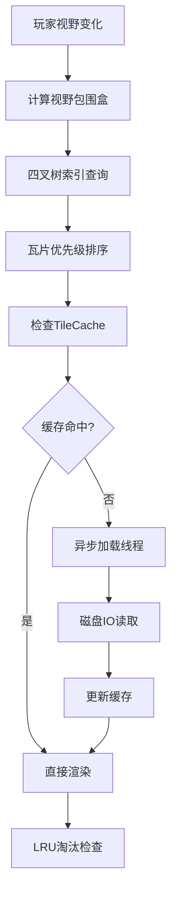

# MicroFun 地图资源拆分与组合技术方案

## 基于自适应四叉树的大地图优化解决方案

---

## 核心问题

### 2D游戏超大地图面临的挑战

- 🔥 **显存占用过高** - 完整地图加载导致内存压力
- ⏱️ **加载时间长** - 游戏启动需等待大量资源
- 📉 **性能瓶颈** - 拖动缩放时卡顿明显
- 💾 **存储冗余** - 纯色区域重复存储

---

## 解决方案

### 自适应四叉树 + 动态加载


**核心思想：**
- 预处理阶段智能拆分地图
- 运行时按需动态加载
- 纯色区域编码优化
- LOD层级渲染支持

---

## 核心优势

### 📊 **大幅降低显存峰值**
仅加载视野内及预加载区域的资源

### ⚡ **缩短初始加载时间**
游戏启动无需等待整张地图加载

### 🎯 **提升渲染帧率稳定性**
异步加载避免IO阻塞导致的卡顿

### 💾 **优化存储空间**
纯色区域编码存储，减少资源冗余

---

## 拆分策略：自适应四叉树

### 智能拆分算法

```
1. 初始化：整张地图作为根节点
2. 复杂度分析：计算区域像素颜色方差
3. 决策分支：
   • 纯色区域 → 停止拆分，记录颜色值
   • 复杂区域 → 拆分为4个子节点
4. 终止条件：最小粒度 32x32 像素
```

**结果：** 纯色节点不生成图片文件，仅存储颜色值

---

## 动态加载机制

### 基于视野的实时调度

#### 🔍 **触发机制**
- 玩家视野（相机）变化触发
- 拖动、缩放实时响应

#### ⚡ **加载策略**
- 视野查询 → 索引查询 → 优先级调度 → 异步加载
- 高LOD + 视野中心 = 最高优先级

#### 🗑️ **卸载策略**
- 固定显存预算（512MB）
- LRU算法淘汰最少使用瓦片

---

## 性能优化

### 缓存与过渡处理

#### 📦 **TileCache 管理**
- 统一缓存管理所有瓦片
- 智能淘汰机制释放显存

#### 🔄 **异步加载**
- 独立线程池处理IO操作
- 避免主线程阻塞

---

## 工作流程

### 系统运行核心流程



---

## 预期性能提升

### 📊 **量化指标**

| 指标 | 优化前 | 优化后 | 提升幅度 |
|------|--------|--------|----------|
| **显存占用** | 全量加载 | 按需加载 | **60-80%** ⬇️ |
| **初始加载** | 完整地图 | 视口瓦片 | **70-90%** ⬇️ |
| **帧率稳定性** | IO阻塞 | 异步处理 | **显著提升** |
| **存储空间** | 原始大小 | 纯色优化 | **30-50%** ⬇️ |

---

## 技术价值总结

### 🎯 **解决核心痛点**
- 解决大地图显存压力
- 实现真正的无缝世界体验

### 🚀 **技术创新点**
- 自适应四叉树拆分算法
- 纯色区域编码优化

### 📈 **商业价值**
- 提升用户体验
- 降低硬件要求
- 支持更大规模地图设计

---

## Thank You

### 基于自适应四叉树的地图优化方案
**让大世界游戏运行如丝般顺滑**